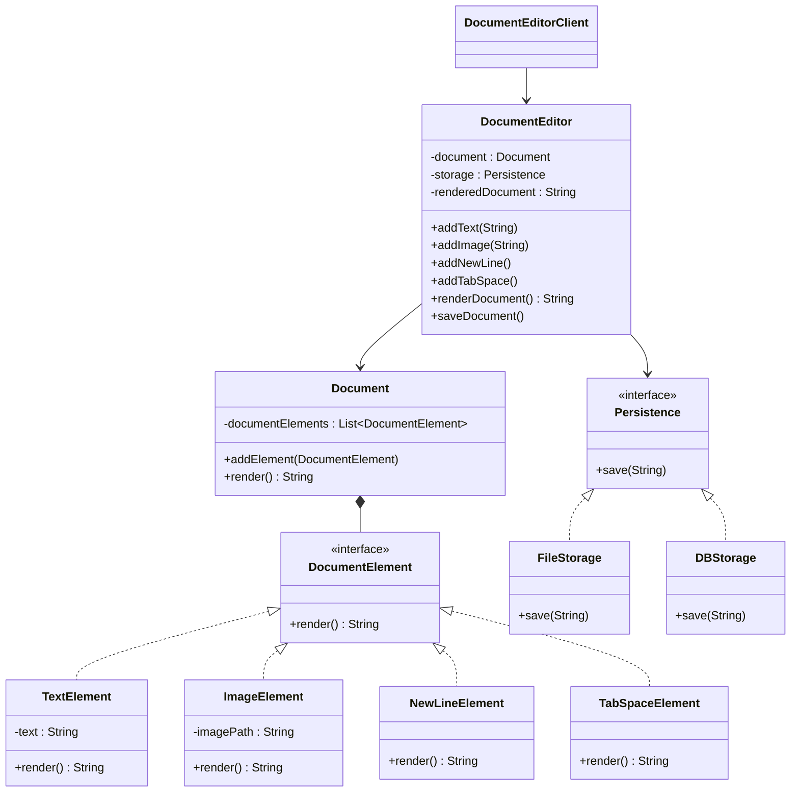

# Document Editor UML

## Design Patterns Used

### Strategy Pattern

* `Persistence` interface defines the saving strategy.
* `FileStorage` and `DBStorage` provide different implementations.

### Composition

* `Document` is composed of multiple `DocumentElement` objects.

### Dependency Injection

* `DocumentEditor` receives `Document` and `Persistence` through its constructor.

### Polymorphism

* Different document elements (`TextElement`, `ImageElement`, etc.) implement the same `DocumentElement` interface.
