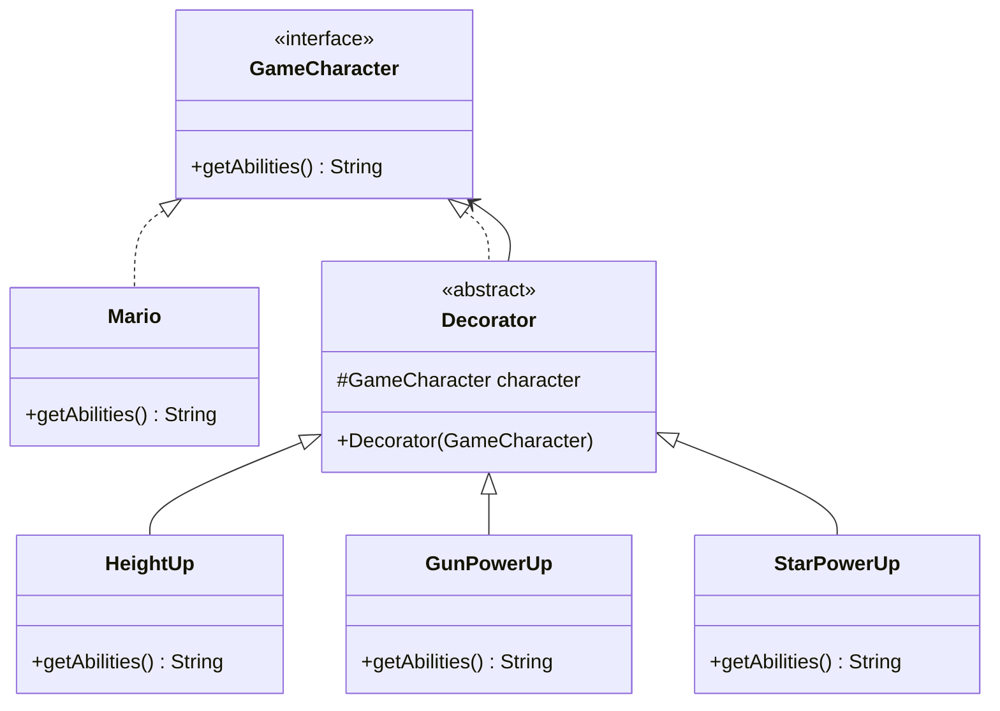

# Decorator Design Pattern - Mario Power Ups



## Pattern Components

### Component

* `GameCharacter`
* Defines the common interface.

### Concrete Component

* `Mario`
* Base object that can be decorated.

### Decorator

* `Decorator`
* Holds a reference to a `GameCharacter`.

### Concrete Decorators

* `HeightUp`
* `GunPowerUp`
* `StarPowerUp`

Each decorator adds new abilities while preserving existing behavior.

## Example Flow

```text
Mario
   ↓
HeightUp
   ↓
GunPowerUp
   ↓
StarPowerUp
```

Final Output:

```text
Mario + Height Up + Gun + Star Power (Limited Time)
```

This demonstrates how functionality can be added dynamically without modifying the original `Mario` class.
