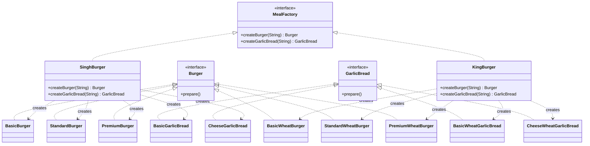

# Abstract Factory Pattern - Meal Factory Example



## Pattern Components

### Abstract Products

#### Burger

Defines the contract for all burgers.

#### GarlicBread

Defines the contract for all garlic breads.

---

### Concrete Products

#### Regular Meal Family

* BasicBurger
* StandardBurger
* PremiumBurger
* BasicGarlicBread
* CheeseGarlicBread

#### Wheat Meal Family

* BasicWheatBurger
* StandardWheatBurger
* PremiumWheatBurger
* BasicWheatGarlicBread
* CheeseWheatGarlicBread

---

### Abstract Factory

```java
interface MealFactory
```

Responsible for creating a family of related products:

```java
Burger createBurger(String type);
GarlicBread createGarlicBread(String type);
```

---

### Concrete Factories

#### SinghBurger

Creates:

* Regular Burgers
* Regular Garlic Breads

#### KingBurger

Creates:

* Wheat Burgers
* Wheat Garlic Breads

---

## Why Abstract Factory?

A factory creates an entire family of related objects.

### SinghBurger Family

```text
BasicBurger
StandardBurger
PremiumBurger

BasicGarlicBread
CheeseGarlicBread
```

### KingBurger Family

```text
BasicWheatBurger
StandardWheatBurger
PremiumWheatBurger

BasicWheatGarlicBread
CheeseWheatGarlicBread
```

The client chooses a factory once:

```java
MealFactory mealFactory = new SinghBurger();
```

and receives compatible products from the same family.

---

## Flow

```text
                MealFactory
                     |
          ------------------------
          |                      |
     SinghBurger            KingBurger
          |                      |
     Regular Meal          Wheat Meal
          |                      |
   Burger + GarlicBread   Burger + GarlicBread
```

---

## Output

```text
Preparing Basic Burger with bun, patty, and ketchup!

Preparing Cheese Garlic Bread with extra cheese and butter!
```
