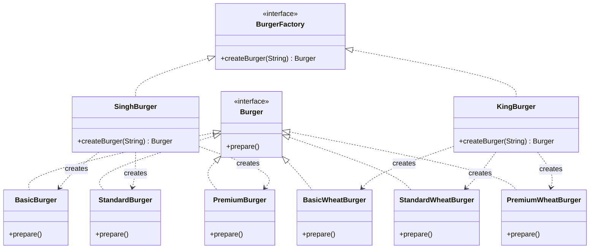

# Factory Method Pattern - Burger Store Example



## Pattern Components

### Product Interface

* `Burger`

### Concrete Products

#### Regular Burger Family

* `BasicBurger`
* `StandardBurger`
* `PremiumBurger`

#### Wheat Burger Family

* `BasicWheatBurger`
* `StandardWheatBurger`
* `PremiumWheatBurger`

### Creator Interface

* `BurgerFactory`

Defines:

```java
Burger createBurger(String type);
```

### Concrete Factories

#### SinghBurger Factory

Creates:

* BasicBurger
* StandardBurger
* PremiumBurger

#### KingBurger Factory

Creates:

* BasicWheatBurger
* StandardWheatBurger
* PremiumWheatBurger

## Flow

```text
Client
   |
   v
BurgerFactory
   |
   +---- SinghBurger
   |          |
   |          +---- BasicBurger
   |          +---- StandardBurger
   |          +---- PremiumBurger
   |
   +---- KingBurger
              |
              +---- BasicWheatBurger
              +---- StandardWheatBurger
              +---- PremiumWheatBurger
```

## Why Factory Method?

Instead of:

```java
Burger burger = new BasicBurger();
```

Client writes:

```java
BurgerFactory factory = new SinghBurger();
Burger burger = factory.createBurger("basic");
```

The client depends only on:

* `Burger`
* `BurgerFactory`

and remains independent of concrete burger implementations.

## Output

```text
Preparing Basic Burger with bun, patty, and ketchup!
```
