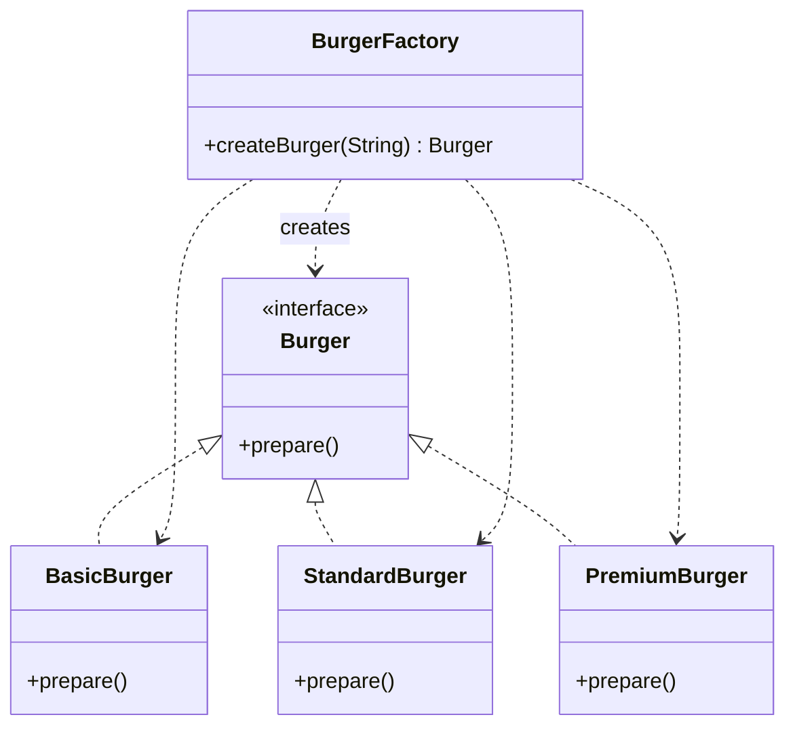

# Simple Factory Pattern - Burger Example



## Pattern Components

### Product Interface

* `Burger`
* Defines the common contract for all burgers.

### Concrete Products

* `BasicBurger`
* `StandardBurger`
* `PremiumBurger`

Each burger provides its own implementation of `prepare()`.

### Factory

* `BurgerFactory`
* Responsible for creating burger objects.
* Client does not directly instantiate burger classes.

## Flow

```text
Client
   |
   v
BurgerFactory
   |
   +----> BasicBurger
   |
   +----> StandardBurger
   |
   +----> PremiumBurger
```

## Why Use Factory Pattern?

Without Factory:

```java
Burger burger = new PremiumBurger();
```

Client is tightly coupled to concrete classes.

With Factory:

```java
Burger burger =
    burgerFactory.createBurger("premium");
```

Client only depends on the `Burger` interface.

## Advantages

* Encapsulates object creation.
* Reduces coupling.
* Easy to add new burger types.
* Follows Open/Closed Principle (with minor factory modification).

## Output

```text
Preparing Standard Burger with bun, patty, cheese and lettuce!
```
