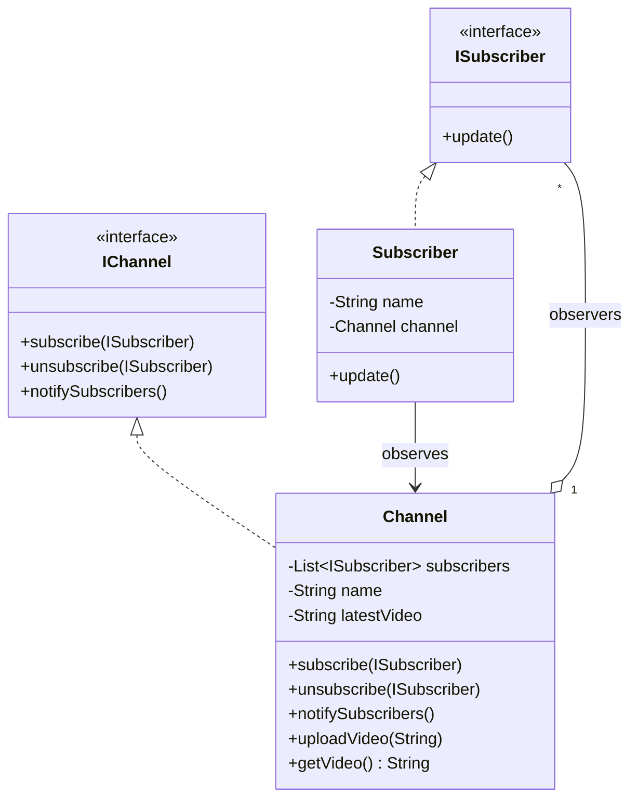

# Observer Design Pattern

## Pattern Components

### Subject

* `Channel`
* Maintains list of subscribers
* Notifies subscribers when a new video is uploaded

### Observer

* `ISubscriber`
* Defines `update()` method

### Concrete Observer

* `Subscriber`
* Receives notifications from channel

### Flow

1. Subscriber subscribes to Channel.
2. Channel uploads a video.
3. Channel calls `notifySubscribers()`.
4. Every subscriber receives `update()`.
5. Unsubscribed users stop receiving notifications.
