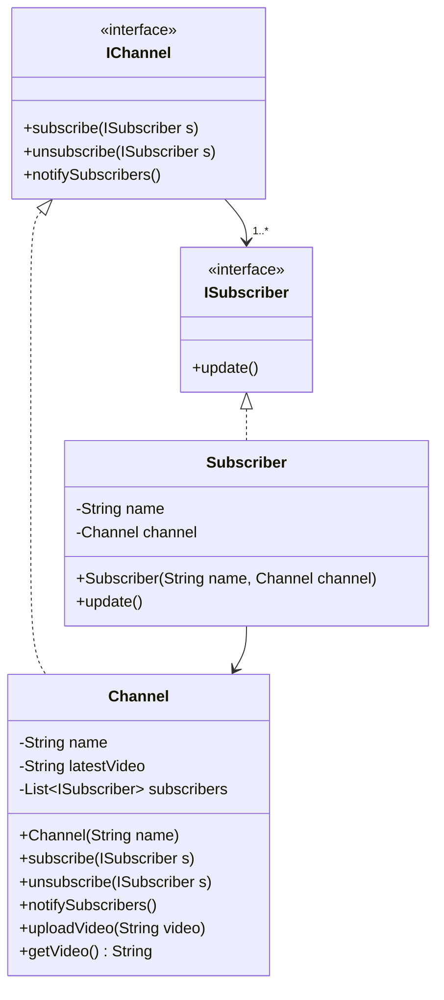

# Observer Design Pattern UML



## Pattern Components

### Subject

* `IChannel`
* Defines methods to subscribe, unsubscribe and notify observers.

### Concrete Subject

* `Channel`
* Stores subscribers.
* Uploads videos.
* Notifies all subscribers when a new video is uploaded.

### Observer

* `ISubscriber`
* Defines the `update()` method.

### Concrete Observer

* `Subscriber`
* Receives notifications from the channel.
* Pulls the latest video information from the channel.

## Flow

1. Subscribers subscribe to a channel.
2. Channel uploads a new video.
3. Channel calls `notifySubscribers()`.
4. Every subscriber receives `update()`.
5. Subscriber fetches the latest video using `channel.getVideo()`.

```
```
