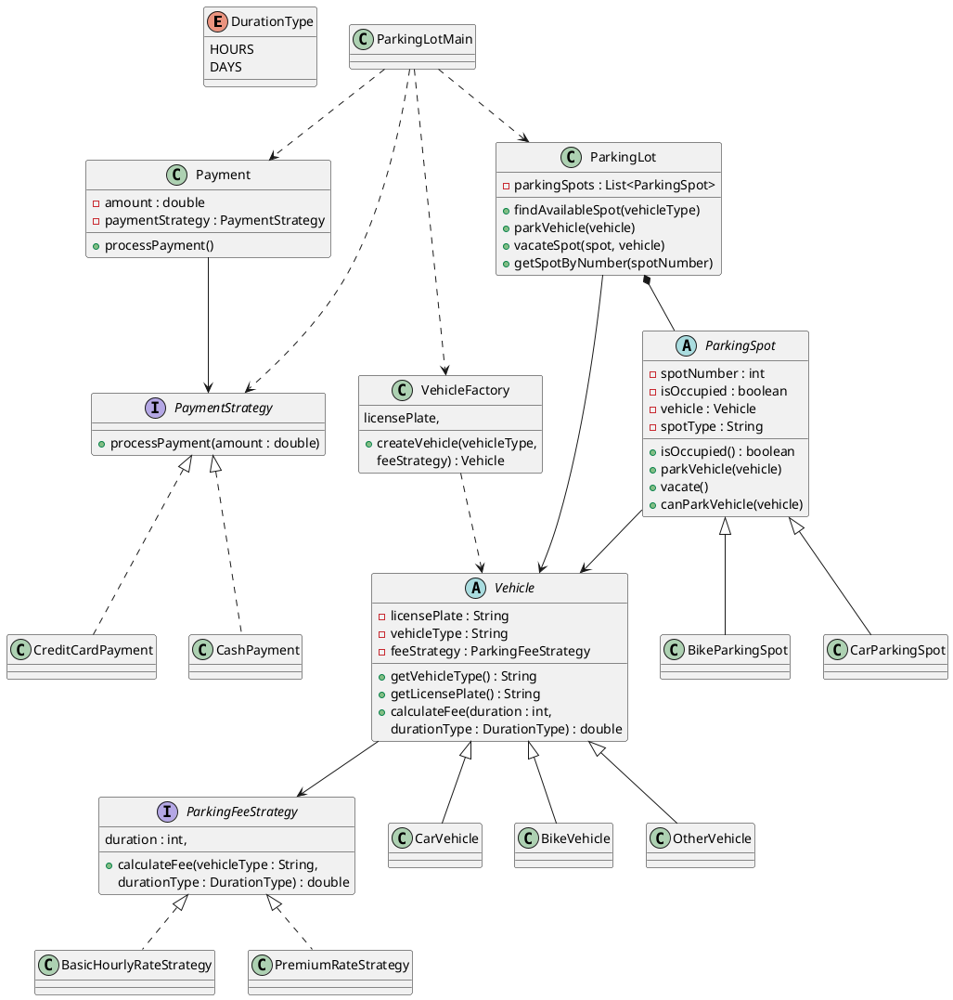

# Parking Lot Management System - UML Class Diagram

## Overview

This system demonstrates the use of:

* **Factory Pattern** (`VehicleFactory`)
* **Strategy Pattern** (`ParkingFeeStrategy`, `PaymentStrategy`)
* **Inheritance** (`Vehicle`, `ParkingSpot`)
* **Composition/Aggregation** (`ParkingLot`, `Payment`)

---

## Class Diagram (PlantUML)



---

## Design Patterns Used

### Factory Pattern

**VehicleFactory**

Responsible for creating different types of vehicles:

* CarVehicle
* BikeVehicle
* OtherVehicle

This hides object creation logic from the client.

---

### Strategy Pattern

#### Parking Fee Strategy

Interface:

```java
ParkingFeeStrategy
```

Implementations:

* BasicHourlyRateStrategy
* PremiumRateStrategy

Allows parking fee calculation logic to vary independently from vehicle classes.

---

#### Payment Strategy

Interface:

```java
PaymentStrategy
```

Implementations:

* CashPayment
* CreditCardPayment

Allows different payment methods without modifying existing code.

---

## Relationships

### Inheritance

* Vehicle ← CarVehicle

* Vehicle ← BikeVehicle

* Vehicle ← OtherVehicle

* ParkingSpot ← CarParkingSpot

* ParkingSpot ← BikeParkingSpot

### Realization

* ParkingFeeStrategy ← BasicHourlyRateStrategy

* ParkingFeeStrategy ← PremiumRateStrategy

* PaymentStrategy ← CashPayment

* PaymentStrategy ← CreditCardPayment

### Composition

* ParkingLot contains ParkingSpot objects

### Association

* ParkingSpot ↔ Vehicle
* Payment ↔ PaymentStrategy
* Vehicle ↔ ParkingFeeStrategy

---

## Suggested Improvements

1. Replace String vehicle types with an enum:

```java
enum VehicleType {
    CAR,
    BIKE,
    AUTO
}
```

2. Introduce a PaymentStrategyFactory.

3. Add a ParkingTicket class containing:

* ticketId
* vehicle
* spot
* entryTime
* exitTime

4. Calculate parking fees automatically using entry and exit timestamps instead of hardcoded durations.

```
```
