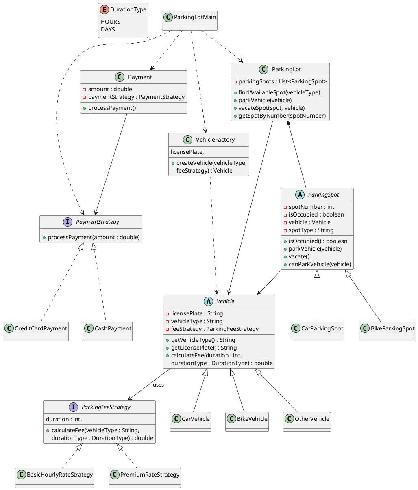

# Parking Lot System - UML Diagram

This UML diagram represents a Parking Lot System designed using Factory and Strategy Design Patterns.

## UML Diagram (PlantUML)

## Design Patterns Used

### Factory Pattern
- `VehicleFactory`
- Responsible for creating different vehicle objects (`CarVehicle`, `BikeVehicle`, `OtherVehicle`).
- Encapsulates object creation logic.

### Strategy Pattern
#### Parking Fee Strategy
- `ParkingFeeStrategy`
- `BasicHourlyRateStrategy`
- `PremiumRateStrategy`

Allows fee calculation logic to be changed without modifying vehicle classes.

#### Payment Strategy
- `PaymentStrategy`
- `CashPayment`
- `CreditCardPayment`

Allows different payment methods to be plugged in dynamically.

## Key Components

| Component | Responsibility |
|------------|---------------|
| Vehicle | Represents a parked vehicle |
| VehicleFactory | Creates vehicle objects |
| ParkingSpot | Represents a parking slot |
| ParkingLot | Manages parking spots and parking operations |
| ParkingFeeStrategy | Calculates parking fees |
| PaymentStrategy | Handles payment processing |
| Payment | Executes payment using a chosen strategy |

## Relationships

- Vehicle uses ParkingFeeStrategy.
- Payment uses PaymentStrategy.
- ParkingLot contains multiple ParkingSpots.
- ParkingSpot can hold one Vehicle.
- VehicleFactory creates Vehicle objects.
