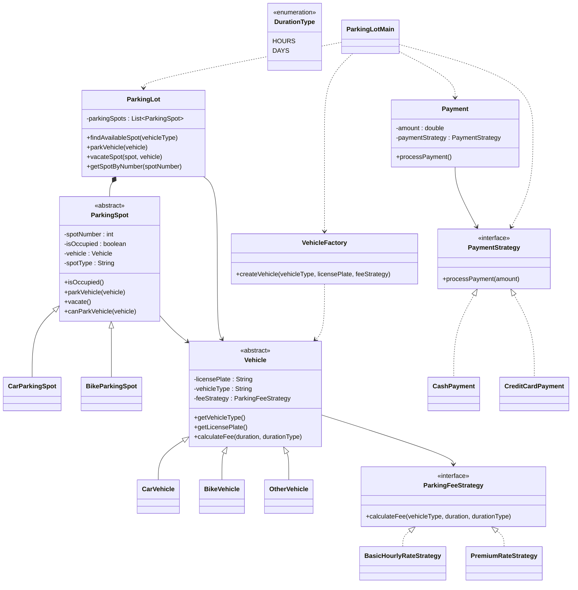

# Parking Lot System UML



## Design Patterns Used

### Strategy Pattern

#### Parking Fee Calculation

* ParkingFeeStrategy
* BasicHourlyRateStrategy
* PremiumRateStrategy

Allows different fee calculation algorithms.

#### Payment Processing

* PaymentStrategy
* CashPayment
* CreditCardPayment

Allows switching payment methods at runtime.

---

### Factory Pattern

* VehicleFactory

Responsible for creating different vehicle types:

* CarVehicle
* BikeVehicle
* OtherVehicle

without exposing creation logic to the client.

---

### Composition

* ParkingLot contains multiple ParkingSpots.

```text
ParkingLot
    |
    +---- ParkingSpot
                |
                +---- CarParkingSpot
                +---- BikeParkingSpot
```

---

### Relationships

#### Vehicle → ParkingFeeStrategy

Each vehicle uses a fee calculation strategy.

#### Payment → PaymentStrategy

Each payment delegates processing to a payment strategy.

#### ParkingSpot → Vehicle

A parking spot can contain a parked vehicle.

#### ParkingLot → ParkingSpot

A parking lot manages multiple parking spots.

---

## Flow

```text
VehicleFactory
      |
      v
    Vehicle
      |
      v
ParkingLot ----> ParkingSpot

Vehicle
   |
   +---- ParkingFeeStrategy

Payment
   |
   +---- PaymentStrategy
```
