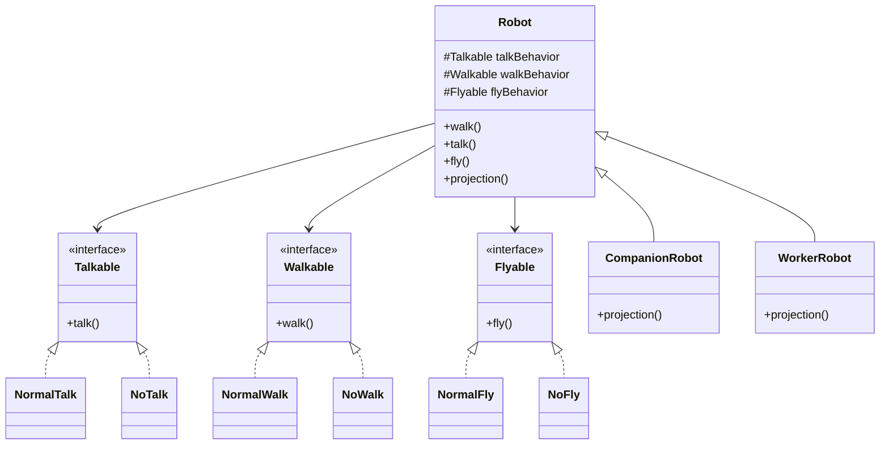

# Strategy Design Pattern - Robot Example

## Strategy Pattern

* `Talkable`, `Walkable`, and `Flyable` are strategy interfaces.
* `NormalTalk`, `NoTalk`, `NormalWalk`, `NoWalk`, `NormalFly`, and `NoFly` are concrete strategies.
* `Robot` is the context class.
* `CompanionRobot` and `WorkerRobot` are specialized robot types.
* Behaviors can be changed by passing different strategy implementations to the constructor.
