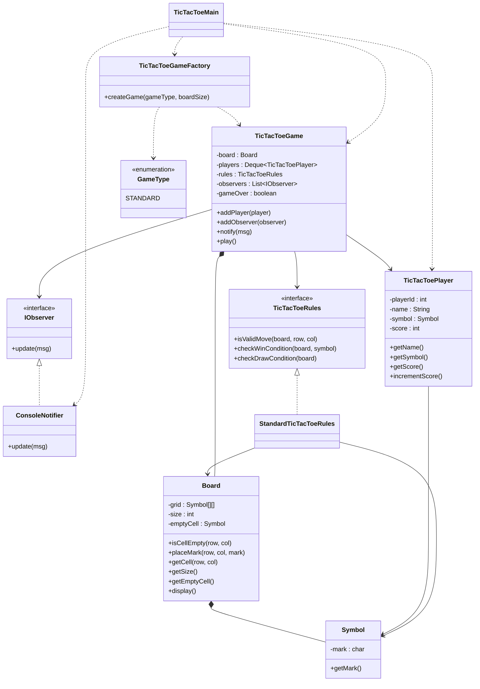

# Tic Tac Toe System UML



# Design Patterns Used

### Strategy Pattern

#### Game Rules

* TicTacToeRules
* StandardTicTacToeRules

Encapsulates the game rules so different rule sets (e.g., Standard, Ultimate, Misère Tic Tac Toe) can be introduced without modifying the game logic.

---

### Observer Pattern

* IObserver
* ConsoleNotifier

The game notifies all registered observers whenever:

* Game starts
* A player makes a move
* A player wins
* The game ends in a draw

This allows additional notification systems (Email, SMS, GUI, Logging, etc.) to be added easily.

---

### Factory Pattern

* TicTacToeGameFactory

Responsible for creating different game variants.

Currently supports:

* STANDARD

Future game types can be added without changing the client code.

---

### Composition

* TicTacToeGame contains one Board.
* Board contains multiple Symbol objects.
* TicTacToePlayer owns one Symbol.

```text
TicTacToeGame
      |
      +---- Board
               |
               +---- Symbol[][]

TicTacToePlayer
      |
      +---- Symbol
```

---

### Relationships

#### TicTacToeGame → Board

The game owns and manages the game board.

#### TicTacToeGame → TicTacToeRules

The game delegates move validation, win checking, and draw checking to the selected rule strategy.

#### TicTacToeGame → TicTacToePlayer

The game maintains players in a queue to alternate turns.

#### TicTacToeGame → IObserver

The game notifies observers about important game events.

#### Board → Symbol

The board stores Symbol objects in every cell.

#### TicTacToePlayer → Symbol

Each player owns exactly one playing symbol.

#### TicTacToeGameFactory → TicTacToeGame

The factory creates game instances based on the selected game type.

---

## Flow

```text
          TicTacToeMain
                 |
                 v
      TicTacToeGameFactory
                 |
                 v
          TicTacToeGame
          /      |      \
         /       |       \
        v        v        v
    Board    TicTacToeRules   Players

Board
   |
   +---- Symbol[][]

Players
   |
   +---- Symbol

Game
   |
   +---- IObserver
             |
             +---- ConsoleNotifier
```
