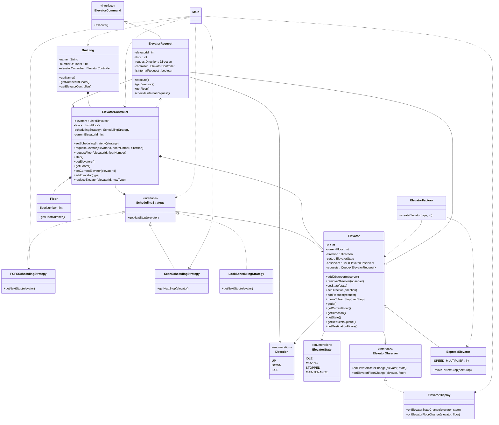

# Elevator System UML



## Design Patterns Used

### Strategy Pattern

* SchedulingStrategy
* FCFSSchedulingStrategy
* ScanSchedulingStrategy
* LookSchedulingStrategy

The scheduling algorithm is separated from the elevator controller.

Different scheduling algorithms can be selected dynamically:

* FCFS
* SCAN
* LOOK

This allows the elevator scheduling behavior to change without modifying the `ElevatorController`.

---

### Observer Pattern

* ElevatorObserver
* ElevatorDisplay

The `Elevator` notifies registered observers when:

* Its state changes
* Its current floor changes

```text
Elevator
    |
    +---- ElevatorObserver
                |
                +---- ElevatorDisplay
```

This allows additional observers such as logging systems, monitoring dashboards, or notification services to be added later.

---

### Command Pattern

* ElevatorCommand
* ElevatorRequest

`ElevatorRequest` encapsulates an elevator request as a command.

It supports two types of requests:

* External request — a passenger requests an elevator from a floor.
* Internal request — a passenger selects a destination floor inside an elevator.

```text
ElevatorRequest
       |
       v
ElevatorController
       |
       +---- requestElevator()
       |
       +---- requestFloor()
```

---

### Factory Pattern

* ElevatorFactory

The factory creates different elevator implementations based on the requested type.

Currently supported types include:

* Standard Elevator
* Express Elevator

```text
ElevatorFactory
      |
      +---- Elevator
      |
      +---- ExpressElevator
```

This makes it easier to add new elevator types without changing the client code.

---

## Composition

### Building → ElevatorController

A `Building` owns its `ElevatorController`.

```text
Building
    |
    +---- ElevatorController
```

### ElevatorController → Elevator

The controller manages the elevators in the building.

```text
ElevatorController
    |
    +---- Elevator
    |
    +---- Elevator
    |
    +---- Elevator
```

### ElevatorController → Floor

The controller maintains the floors available in the building.

```text
ElevatorController
    |
    +---- Floor
    |
    +---- Floor
    |
    +---- Floor
```

---

## Relationships

### Elevator → ElevatorObserver

The elevator maintains a list of observers and notifies them about state and floor changes.

### Elevator → ElevatorRequest

The elevator maintains a queue of pending requests.

### ElevatorController → SchedulingStrategy

The controller delegates the decision of the next elevator stop to the selected scheduling strategy.

### ElevatorRequest → ElevatorController

An elevator request delegates its execution to the controller.

### ElevatorController → Elevator

The controller manages and operates all elevators.

### ElevatorController → Floor

The controller maintains the floors of the building.

### Elevator → Direction

Each elevator has a current direction:

* UP
* DOWN
* IDLE

### Elevator → ElevatorState

Each elevator has an operational state:

* IDLE
* MOVING
* STOPPED
* MAINTENANCE

### ExpressElevator → Elevator

`ExpressElevator` extends the base `Elevator` and overrides movement behavior.

---

## Flow

```text
                    Building
                       |
                       v
              ElevatorController
                 /      |       \
                /       |        \
               v        v         v
          Elevators    Floors   SchedulingStrategy
              |                    |
              |                    +---- FCFS
              |                    +---- SCAN
              |                    +---- LOOK
              |
              +---- ElevatorRequest
              |
              +---- ElevatorObserver
                           |
                           +---- ElevatorDisplay
```

## Request Flow

```text
User
 |
 +---- External Request
 |          |
 |          v
 |   ElevatorRequest
 |          |
 |          v
 |   ElevatorController
 |          |
 |          v
 |      Elevator
 |
 +---- Internal Request
            |
            v
      ElevatorRequest
            |
            v
     ElevatorController
            |
            v
         Elevator
```

## Scheduling Flow

```text
ElevatorController
        |
        v
SchedulingStrategy
        |
        +---- FCFS
        |
        +---- SCAN
        |
        +---- LOOK
        |
        v
    Next Stop
        |
        v
     Elevator
        |
        v
  moveToNextStop()
```

## Elevator Type Creation Flow

```text
ElevatorController
        |
        v
 ElevatorFactory
        |
        +---- Standard Elevator
        |
        +---- ExpressElevator
        |
        v
     Elevator
```
