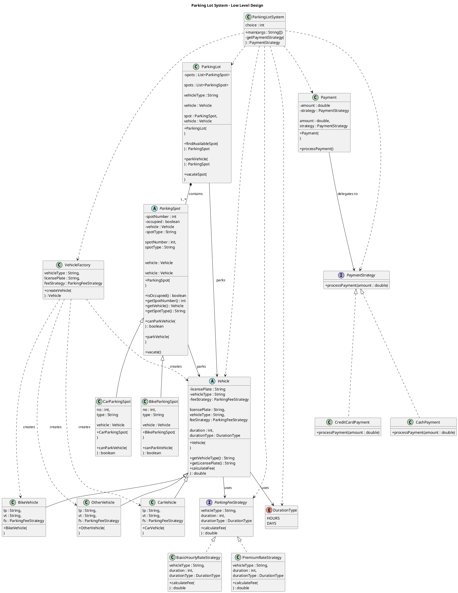

# Parking Lot System — UML Diagram

## Design Patterns Used

* **Strategy Pattern**

  * `ParkingFeeStrategy`
  * `BasicHourlyRateStrategy`
  * `PremiumRateStrategy`
  * `PaymentStrategy`
  * `CashPayment`
  * `CreditCardPayment`

* **Factory Pattern**

  * `VehicleFactory`

* **Inheritance**

  * `Vehicle` → `CarVehicle`, `BikeVehicle`, `OtherVehicle`
  * `ParkingSpot` → `CarParkingSpot`, `BikeParkingSpot`

* **Composition**

  * `ParkingLot` contains multiple `ParkingSpot` objects.

---

## Class Diagram



---

## Main Relationships

### 1. Fee Strategy

```text
ParkingFeeStrategy
        ▲
        │ implements
        │
 ┌──────┴─────────────────┐
 │                        │
BasicHourlyRateStrategy  PremiumRateStrategy
```

`Vehicle` contains a `ParkingFeeStrategy`, so the fee calculation can be changed without modifying the `Vehicle` class.

---

### 2. Vehicle Factory

```text
             VehicleFactory
                   │
                creates
                   │
          ┌────────┼────────┐
          ▼        ▼        ▼
        Car      Bike     Other
      Vehicle   Vehicle   Vehicle
```

The client does not directly need to instantiate the concrete vehicle classes.

---

### 3. Payment Strategy

```text
              PaymentStrategy
                    ▲
                    │
          implements│
            ┌───────┴────────┐
            │                │
      CashPayment      CreditCardPayment
```

`Payment` acts as the **Context**:

```text
Payment
   │
   │ has-a
   ▼
PaymentStrategy
```

The actual payment operation is delegated to the selected strategy.

---

### 4. Parking Spot Hierarchy

```text
             ParkingSpot
                  ▲
                  │
          ┌───────┴────────┐
          │                │
   CarParkingSpot   BikeParkingSpot
```

Each parking spot determines whether a particular vehicle can park there.

---

### 5. Parking Lot Composition

```text
ParkingLot
    │
    │ contains
    ▼
ParkingSpot
```

The `ParkingLot` maintains a collection:

```java
private List<ParkingSpot> spots;
```

Therefore, the UML uses **composition**:

```text
ParkingLot *-- ParkingSpot
```

---

## Overall Architecture

```text
                         ┌───────────────────────┐
                         │   ParkingLotSystem    │
                         └───────────┬───────────┘
                                     │
                  ┌──────────────────┼──────────────────┐
                  │                  │                  │
                  ▼                  ▼                  ▼
          VehicleFactory        ParkingLot          Payment
                  │                  │                  │
                  ▼                  ▼                  ▼
              Vehicle          ParkingSpot      PaymentStrategy
                  │                  │                  │
                  ▼                  ▼                  ▼
        ParkingFeeStrategy    Car/Bike Spot     Cash/CreditCard
```

---

## Patterns Summary

| Pattern     | Classes                      | Purpose                               |
| ----------- | ---------------------------- | ------------------------------------- |
| Strategy    | `ParkingFeeStrategy`         | Different fee calculation algorithms  |
| Strategy    | `PaymentStrategy`            | Different payment methods             |
| Factory     | `VehicleFactory`             | Creates appropriate vehicle objects   |
| Inheritance | `Vehicle` hierarchy          | Represents different vehicle types    |
| Inheritance | `ParkingSpot` hierarchy      | Represents different parking spots    |
| Composition | `ParkingLot` → `ParkingSpot` | Parking lot manages its parking spots |

---

## Important Note

The current implementation uses:

```java
private static PaymentStrategy getPaymentStrategy(int choice)
```

inside `ParkingLotSystem` to select the payment strategy.

If you later introduce a separate `PaymentFactory`, the UML should be updated to:

```text
ParkingLotSystem
       │
       ▼
PaymentFactory
       │
       ▼
PaymentStrategy
```

That would make the payment-strategy creation responsibility cleaner and remove the strategy-selection logic from `ParkingLotSystem`.
